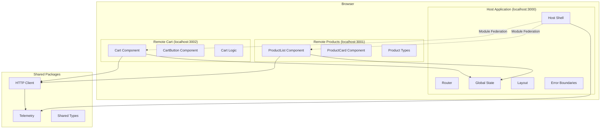

# Architecture Documentation

This document provides detailed technical information about the micro frontend architecture implementation.

## 🏗️ System Architecture

### High-Level Overview



## 🔧 Module Federation Configuration

### Host Application Configuration

```javascript
// apps/host/next.config.js
const ModuleFederationPlugin = require('@module-federation/nextjs-mf');

module.exports = {
  webpack: (config) => {
    config.plugins.push(
      new ModuleFederationPlugin({
        name: 'host',
        remotes: {
          'remote-products': 'remoteProducts@http://localhost:3001/_next/static/chunks/remoteEntry.js',
          'remote-cart': 'remoteCart@http://localhost:3002/_next/static/chunks/remoteEntry.js',
        },
        shared: {
          'react': { singleton: true, requiredVersion: false },
          'react-dom': { singleton: true, requiredVersion: false },
        },
      })
    );
    return config;
  },
};
```

### Remote Applications Configuration

```javascript
// apps/remote-products/next.config.js
module.exports = {
  webpack: (config) => {
    config.plugins.push(
      new ModuleFederationPlugin({
        name: 'remoteProducts',
        filename: 'static/chunks/remoteEntry.js',
        exposes: {
          './ProductList': './src/components/ProductList',
          './ProductCard': './src/components/ProductCard',
        },
        shared: {
          'react': { singleton: true, requiredVersion: false },
          'react-dom': { singleton: true, requiredVersion: false },
        },
      })
    );
    return config;
  },
};
```

## 🔄 State Management Architecture

### Global Context Pattern

```typescript
// Global context exposed via window object
interface CartContext {
  items: CartItem[];
  addToCart: (product: Product) => void;
  removeItem: (id: string) => void;
  updateQuantity: (id: string, quantity: number) => void;
  clearCart: () => void;
  total: number;
}

// Host exposes context
window.__CART_CONTEXT__ = cartContext;

// Remotes consume context
const cartContext = window.__CART_CONTEXT__;
```

### Context Provider Implementation

```typescript
// apps/host/src/context/CartContext.tsx
export const CartProvider: React.FC<{ children: React.ReactNode }> = ({
  children,
}) => {
  const [items, setItems] = useState<CartItem[]>([]);
  
  const contextValue = useMemo(() => ({
    items,
    addToCart,
    removeItem,
    updateQuantity,
    clearCart,
    total: calculateTotal(items),
  }), [items]);

  // Expose globally for micro frontends
  useEffect(() => {
    window.__CART_CONTEXT__ = contextValue;
  }, [contextValue]);

  return (
    <CartContext.Provider value={contextValue}>
      {children}
    </CartContext.Provider>
  );
};
```

## 📦 Package Architecture

### Shared Packages Structure

```
packages/
├── http-client/              # HTTP utilities with retry logic
│   ├── src/
│   │   ├── http-client.ts    # Main client implementation
│   │   ├── retry.ts          # Exponential backoff logic
│   │   ├── types.ts          # TypeScript definitions
│   │   └── index.ts          # Public API
│   └── package.json
│
└── telemetry/                # OpenTelemetry integration
    ├── src/
    │   ├── telemetry.ts      # Tracing setup
    │   ├── metrics.ts        # Custom metrics
    │   └── types.ts          # Telemetry types
    └── package.json
```

### Package Dependencies

```json
{
  "dependencies": {
    "@shared/http-client": "workspace:*",
    "@shared/telemetry": "workspace:*"
  }
}
```

## 🚦 Routing Architecture

### Host Application Routing

```typescript
// apps/host/src/pages/_app.tsx
export default function App({ Component, pageProps }: AppProps) {
  return (
    <CartProvider>
      <TelemetryProvider>
        <Layout>
          <Component {...pageProps} />
        </Layout>
      </TelemetryProvider>
    </CartProvider>
  );
}
```

### Route Structure

```
Host Routes:
├── / (homepage)
├── /products (product catalog)
├── /cart (shopping cart)
└── /checkout (checkout flow)

Remote Products:
├── /products/list (standalone product list)
└── /products/[id] (product details)

Remote Cart:
├── /cart/view (standalone cart view)
└── /cart/checkout (checkout process)
```

## 🔄 Component Loading Strategy

### Dynamic Imports with Error Handling

```typescript
// Dynamic import with fallback
const ProductList = dynamic(
  () =>
    import('remote-products/ProductList').catch(() => ({
      default: ProductListFallback,
    })),
  {
    ssr: false,
    loading: () => <ProductListSkeleton />,
  }
);
```

### Error Boundaries for Micro Frontends

```typescript
class MicrofrontendErrorBoundary extends React.Component {
  constructor(props) {
    super(props);
    this.state = { hasError: false, error: null };
  }

  static getDerivedStateFromError(error) {
    return { hasError: true, error };
  }

  componentDidCatch(error, errorInfo) {
    console.error('Microfrontend Error:', error, errorInfo);
    // Send to telemetry
  }

  render() {
    if (this.state.hasError) {
      return <MicrofrontendFallback error={this.state.error} />;
    }

    return this.props.children;
  }
}
```

## 📊 Performance Considerations

### Bundle Optimization

1. **Shared Dependencies**
   - React and React-DOM as singletons
   - Common utilities shared across remotes
   - Version management for compatibility

2. **Code Splitting**
   - Route-based splitting in each micro frontend
   - Component-level splitting for large components
   - Lazy loading of non-critical features

3. **Caching Strategy**
   - Aggressive caching of remote entries
   - Cache busting for deployments
   - CDN optimization for static assets

### Loading Performance

```typescript
// Preload critical micro frontends
const preloadMicrofrontends = () => {
  // Preload product list for faster navigation
  import('remote-products/ProductList');
  // Preload cart for instant access
  import('remote-cart/CartButton');
};

// Call on app initialization
useEffect(() => {
  preloadMicrofrontends();
}, []);
```

## 🔒 Security Architecture

### Content Security Policy

```javascript
// next.config.js security headers
module.exports = {
  async headers() {
    return [
      {
        source: '/(.*)',
        headers: [
          {
            key: 'Content-Security-Policy',
            value: "script-src 'self' localhost:3001 localhost:3002 'unsafe-eval';"
          }
        ]
      }
    ];
  }
};
```

### Cross-Origin Considerations

1. **CORS Configuration**
   - Allow specific origins for remote loading
   - Restrict to development/production domains
   - Handle preflight requests properly

2. **Data Validation**
   - Validate all data from remote sources
   - Sanitize user inputs across boundaries
   - Type checking for cross-boundary calls

## 📈 Monitoring & Observability

### OpenTelemetry Integration

```typescript
// Telemetry setup
export const initTelemetry = () => {
  const provider = new WebTracerProvider({
    resource: new Resource({
      [SemanticResourceAttributes.SERVICE_NAME]: 'spider-man-store',
      [SemanticResourceAttributes.SERVICE_VERSION]: '1.0.0',
    }),
  });

  provider.addSpanProcessor(
    new SimpleSpanProcessor(new ConsoleSpanExporter())
  );

  provider.register();
};
```

### Custom Metrics

```typescript
// Business metrics
export const trackAddToCart = (product: Product) => {
  const span = tracer.startSpan('cart.add_item');
  span.setAttributes({
    'product.id': product.id,
    'product.price': product.price,
    'cart.item_count': getCartItemCount(),
  });
  span.end();
};
```

## 🚀 Deployment Architecture

### Multi-Environment Strategy

```yaml
# Production deployment flow
environments:
  development:
    host: localhost:3000
    remotes:
      products: localhost:3001
      cart: localhost:3002
  
  staging:
    host: staging-host.vercel.app
    remotes:
      products: staging-products.vercel.app
      cart: staging-cart.vercel.app
  
  production:
    host: spider-man-store.vercel.app
    remotes:
      products: products.spider-man-store.vercel.app
      cart: cart.spider-man-store.vercel.app
```

### Independent Deployment Process

1. **Remote Deployment**
   ```bash
   # Deploy remotes first
   cd apps/remote-products && vercel --prod
   cd apps/remote-cart && vercel --prod
   ```

2. **Host Deployment**
   ```bash
   # Update remote URLs and deploy host
   cd apps/host && vercel --prod
   ```

3. **Rollback Strategy**
   - Keep previous versions of remotes available
   - Quick rollback by updating remote URLs
   - Gradual rollout using feature flags

## 🔧 Development Tools

### TypeScript Configuration

```json
// tsconfig.json with project references
{
  "compilerOptions": {
    "composite": true,
    "declaration": true,
    "declarationMap": true
  },
  "references": [
    { "path": "./packages/http-client" },
    { "path": "./packages/telemetry" },
    { "path": "./apps/host" },
    { "path": "./apps/remote-products" },
    { "path": "./apps/remote-cart" }
  ]
}
```

### Development Workflow

```bash
# Start development with hot reloading
pnpm dev

# Type checking across all projects
pnpm type-check

# Build in dependency order
pnpm build

# Test all packages
pnpm test
```

This architecture provides a scalable, maintainable foundation for micro frontend development while maintaining performance and developer experience.