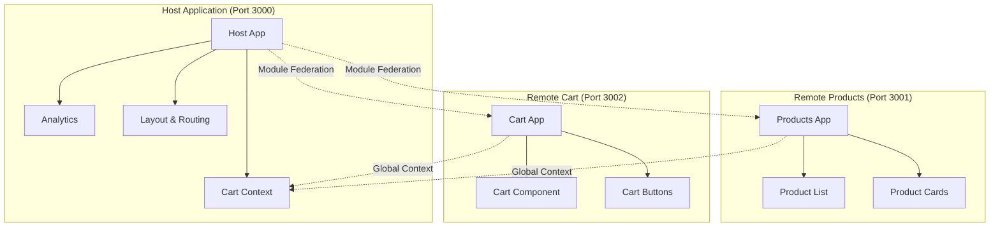

# 🕷️ Spider-Man Store - Micro Frontend Architecture

> Complete micro frontend e-commerce application built with Next.js, Module Federation, and modern web technologies

## 📋 Table of Contents

- [Overview](#overview)
- [Architecture](#architecture)
- [Micro Frontend Communication](#micro-frontend-communication)
- [Features](#features)
- [Getting Started](#getting-started)
- [Project Structure](#project-structure)
- [Technologies](#technologies)
- [Testing](#testing)
- [Development Guidelines](#development-guidelines)

## 🎯 Overview

This project demonstrates a production-ready micro frontend architecture using **Next.js** and **Module Federation**. It features a Spider-Man themed e-commerce store with three independent applications working together seamlessly.

The architecture showcases modern patterns for building scalable, maintainable, and independently deployable frontend applications.

## 🏗️ Architecture



### Applications Overview

| Application | Port | Responsibility | Exposes |
|-------------|------|---------------|---------|
| **Host** | 3000 | Main orchestrator, layout, state management | CartProvider, Analytics |
| **Products** | 3001 | Product catalog and related components | ProductList, ProductCard |
| **Cart** | 3002 | Shopping cart functionality | Cart, CartButton |

## 🔄 Micro Frontend Communication

### Current Approach: Global Context via Window Object

**How it works:**
```typescript
// Host exposes cart context globally
window.__CART_CONTEXT__ = {
  addToCart: (product) => { /* ... */ },
  items: [],
  updateQuantity: (id, quantity) => { /* ... */ },
  removeItem: (id) => { /* ... */ }
}

// Remote apps access the global context
if (window.__CART_CONTEXT__) {
  window.__CART_CONTEXT__.addToCart(product);
}
```

**Why this approach?**
- ✅ **Simplicity**: Easy to implement and understand
- ✅ **Framework Agnostic**: Works with any JavaScript framework
- ✅ **Real-time Sync**: Immediate state updates across micro frontends
- ✅ **No Additional Dependencies**: No need for message buses or event systems
- ✅ **Type Safety**: Can be typed with TypeScript declarations

**Trade-offs:**
- ⚠️ **Global State**: Uses global namespace (mitigated with namespacing)
- ⚠️ **Polling**: Uses setInterval for updates (could use observers)

### Alternative Approaches

#### 1. **Custom Events + Event Bus**
```typescript
// Publish events
window.dispatchEvent(new CustomEvent('cart:add', { 
  detail: { product } 
}));

// Subscribe to events
window.addEventListener('cart:add', (event) => {
  // Handle cart addition
});
```

**Pros:** Decoupled, event-driven, no polling  
**Cons:** More complex, harder to debug, no type safety

#### 2. **Shared State Library (Zustand/Redux)**
```typescript
// Shared store across micro frontends
import { useCartStore } from '@shared/cart-store';

const addToCart = useCartStore(state => state.addToCart);
```

**Pros:** Structured state management, devtools support  
**Cons:** Shared dependency, version conflicts, bundle duplication

#### 3. **Props Drilling from Host**
```typescript
// Host passes handlers as props
<ProductList onAddToCart={handleAddToCart} />
```

**Pros:** Explicit data flow, React-like patterns  
**Cons:** Props coupling, harder to maintain with deep nesting

#### 4. **PostMessage API**
```typescript
// Cross-frame communication
parent.postMessage({ type: 'ADD_TO_CART', product }, '*');
```

**Pros:** True isolation, works with iframes  
**Cons:** Complex serialization, performance overhead

### Why Global Context Was Chosen

1. **Rapid Prototyping**: Fastest to implement and iterate
2. **Type Safety**: Easy to add TypeScript definitions
3. **React Compatibility**: Works well with React's mental model
4. **Performance**: Direct function calls, no serialization
5. **Debugging**: Easy to inspect state in browser devtools

For production applications, consider migrating to **Custom Events** or a **Shared State Library** for better architecture.

## ✨ Features

### 🛒 E-commerce Functionality
- Product catalog with Spider-Man themed items
- Shopping cart with real-time updates
- Add/remove items with quantity management
- Checkout flow with notifications
- Pricing in Brazilian Reais (R$)

### 🏗️ Technical Features
- **Module Federation**: Runtime code sharing between applications
- **HTTP Client**: Robust client with exponential backoff retry, jitter, and idempotency
- **OpenTelemetry**: Distributed tracing and observability with RED/USE metrics
- **Analytics**: Page view and interaction tracking
- **Responsive Design**: Mobile-first approach with modern CSS
- **Error Handling**: Graceful degradation and error boundaries

### 🧪 Quality Assurance
- **Unit Tests**: Jest + Testing Library for component testing
- **E2E Tests**: Playwright for integration testing
- **TypeScript**: Full type safety across all applications
- **Linting**: ESLint with consistent code standards

## 🚀 Getting Started

### Prerequisites
- **Node.js** 18+ (LTS recommended)
- **PNPM** 8+ (for efficient package management)

### Installation

1. **Clone the repository:**
```bash
git clone https://github.com/Felipeness/micro-frontend-nextjs.git
cd micro-frontend-nextjs
```

2. **Install dependencies:**
```bash
pnpm install
```

3. **Start all applications:**
```bash
pnpm run dev
```

4. **Open your browser:**
   - **Main Store**: http://localhost:3000
   - **Products Service**: http://localhost:3001
   - **Cart Service**: http://localhost:3002

### Development Workflow

```bash
# Install dependencies
pnpm install

# Start all apps in development mode
pnpm run dev

# Run tests
pnpm test

# Run E2E tests
pnpm test:e2e

# Build all applications
pnpm run build

# Type checking
pnpm run type-check

# Linting
pnpm run lint
```

## 📁 Project Structure

```
micro-frontend-nextjs/
├── 📱 apps/
│   ├── host/                     # Main application (Port 3000)
│   │   ├── src/
│   │   │   ├── components/       # Shared UI components
│   │   │   ├── context/          # React Context providers
│   │   │   ├── lib/              # Utility functions
│   │   │   └── types/            # TypeScript definitions
│   │   ├── pages/                # Next.js pages
│   │   ├── styles/               # Global styles
│   │   └── next.config.js        # Module Federation config
│   │
│   ├── remote-products/          # Products micro frontend (Port 3001)
│   │   ├── src/components/       # Product-related components
│   │   ├── pages/                # Product pages
│   │   └── next.config.js        # MF config for products
│   │
│   └── remote-cart/              # Cart micro frontend (Port 3002)
│       ├── src/components/       # Cart-related components
│       ├── pages/                # Cart pages
│       └── next.config.js        # MF config for cart
│
├── 📦 packages/
│   ├── http-client/              # Shared HTTP client with retry logic
│   │   ├── src/
│   │   │   ├── http-client.ts    # Main HTTP client
│   │   │   ├── retry.ts          # Retry mechanisms
│   │   │   └── types.ts          # TypeScript definitions
│   │   └── __tests__/            # Unit tests
│   │
│   └── telemetry/                # OpenTelemetry configuration
│       ├── src/
│       │   ├── telemetry.ts      # Tracing setup
│       │   └── types.ts          # Telemetry types
│       └── __tests__/            # Tests
│
├── 🔧 types/                     # Global TypeScript definitions
├── 📋 package.json               # Root package configuration
├── 🔒 pnpm-workspace.yaml       # PNPM workspace config
└── 📖 README.md                  # This file
```

## 🛠️ Technologies

### Core Framework
- **[Next.js 14](https://nextjs.org/)** - React framework with App Router
- **[React 18](https://react.dev/)** - UI library with concurrent features
- **[TypeScript 5](https://www.typescriptlang.org/)** - Type-safe JavaScript

### Micro Frontend Architecture
- **[Module Federation](https://webpack.js.org/concepts/module-federation/)** - Webpack 5 micro frontend solution
- **[@module-federation/nextjs-mf](https://www.npmjs.com/package/@module-federation/nextjs-mf)** - Next.js Module Federation plugin

### State Management & Communication
- **React Context** - Local state management
- **Global Context Pattern** - Cross-micro frontend communication
- **Custom Analytics** - Event tracking and user interaction monitoring

### HTTP & Observability
- **Custom HTTP Client** - With exponential backoff and jitter
- **[OpenTelemetry](https://opentelemetry.io/)** - Distributed tracing and metrics
- **RED/USE Metrics** - Request rate, error rate, duration monitoring

### Testing & Quality
- **[Jest](https://jestjs.io/)** - Unit testing framework
- **[Testing Library](https://testing-library.com/)** - React component testing
- **[Playwright](https://playwright.dev/)** - End-to-end testing
- **[ESLint](https://eslint.org/)** - Code linting and standards

### Development Tools
- **[PNPM](https://pnpm.io/)** - Fast, disk space efficient package manager
- **[Concurrently](https://www.npmjs.com/package/concurrently)** - Run multiple commands simultaneously
- **[TypeScript Project References](https://www.typescriptlang.org/docs/handbook/project-references.html)** - Monorepo type checking

## 🧪 Testing

### Unit Tests
```bash
# Run all unit tests
pnpm test

# Run tests in watch mode
pnpm test:watch

# Run tests with coverage
pnpm test:coverage

# Test specific package
pnpm --filter http-client test
```

### Integration Tests
```bash
# Run Playwright E2E tests
pnpm test:e2e

# Run E2E tests in UI mode
pnpm test:e2e:ui

# Run E2E tests for specific browser
pnpm test:e2e --project=chromium
```

### Test Structure
- **Unit Tests**: Located in `__tests__` folders within each package
- **Integration Tests**: Located in `e2e` folders within applications
- **Test Utilities**: Shared test helpers and mocks

## 📋 Development Guidelines

### Code Standards
- **Conventional Commits**: Use semantic commit messages
- **TypeScript Strict Mode**: All code must pass strict type checking
- **ESLint Rules**: Follow established linting rules
- **Component Structure**: Keep components small and focused

### Micro Frontend Best Practices
1. **Independent Deployments**: Each app should be deployable independently
2. **Shared Dependencies**: Minimize shared runtime dependencies
3. **Error Boundaries**: Implement proper error handling
4. **Performance**: Lazy load micro frontends when possible
5. **Testing**: Test each micro frontend in isolation

### Adding New Micro Frontends
1. Create new app in `apps/` directory
2. Configure Module Federation in `next.config.js`
3. Add to workspace in `pnpm-workspace.yaml`
4. Update host application to consume new remote
5. Add appropriate tests and documentation

---

## 📄 License

This project is open source and available under the [MIT License](LICENSE).

## 🤝 Contributing

Contributions are welcome! Please read our contributing guidelines and submit pull requests for any improvements.

## 📞 Support

If you have questions or need help with this project, please open an issue in the GitHub repository.